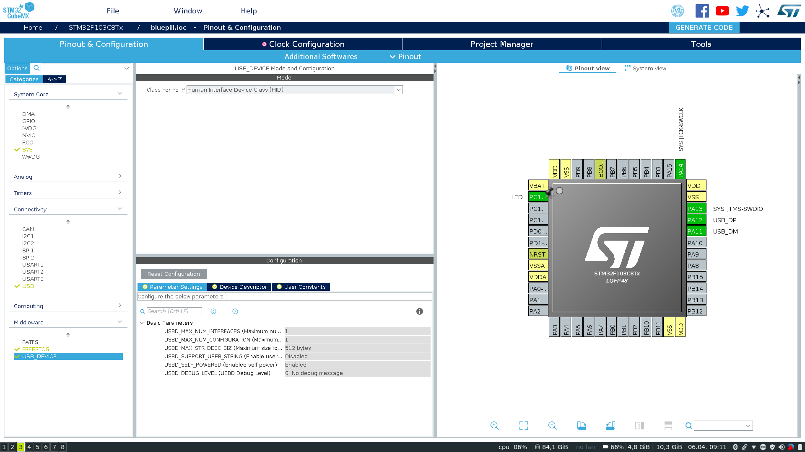
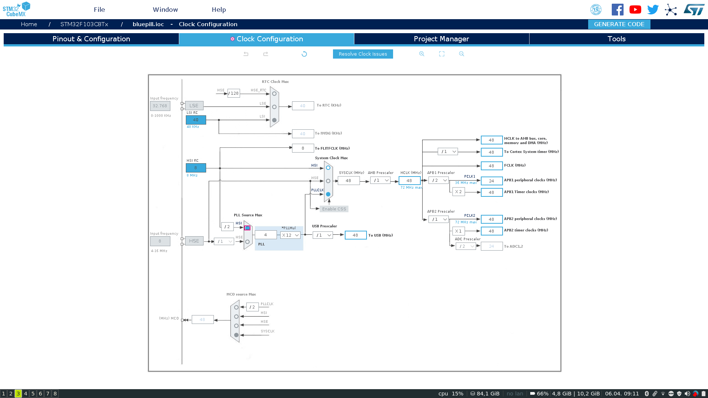

# Cube MX HID

The first step to using the bluepill with USB is to enable the appropriate components and set the clock correctly to generate the required 48MHz clock.

The configuration is quite easy, in connectivity enable USB as a full speed device, you shouldn't need to change any configurations of the USB. Then in middleware, after enabling `USB_DEVICE`, select the "Class for FS IP" to be "Human Interface Device Class (HID)". Avoid selecting the custom HID for now as this is more work to set up and for this basic example we will stick with their generated example (mouse) for now.



After enabling USB we must configure the board such that we have a correct clock on the USB lines to enable data transfer. The automatic clock resolved from Cube is usually pretty good but in this case it sucked and I had to find a configuration myself. See the below image and configure your clock to be the same.



After doing this you can clock generate code, making sure when asked to use "Makefile" toolchain/IDE as we will just build on the command line and use `openocd` to flash the binary.

Now we need to add a few little changes. I will commit the generated files now and then the modifications so we can see the changes through a diff. Now we need to modify a few small things and create a little loop to send some HID commands.

In `usb_device.c` there is the `USBD_HandleTypeDef` usb handle called `hUsbDeviceFS`, this is the handle to the core USB device that we will wish to send our HID report through. To access this in `main.c` we will need to add an `extern` definition of it to `usb_device.h`.

Now inside `usbd_hid.h` is the function `USBD_HID_SendReport` which we will want to use, do let's include that file to our main. Next, and without really describing what HID descriptors are/are writtern/do let me just say the the current HID descriptor being used is defined in `Middlewares/ST/ST32_USB_Device_Library/Class/Src/usbd_hid.c` in the static array `HID_MOUSE_ReportDesc`. This descriptor describes a mouse HID device where two 4 bit values are sent, the pressed buttons, the x value change, the y value change and the scroll wheel change.

For now we will not touch this but instead create a struct in main that we can use to create mouse HID reports to send.

```
struct mouseHID_t {
    uint8_t buttons;
    uint8_t x;
    uint8_t y;
    uint8_t wheel;
};
```

is our struct that we can then typecast to a uint8_t array when sending. Now that we have our HID descriptor data structure we can populate one and send it. For this example I have just set the x change to 10 and put the sending of it in a loop. Doing this will cause the mouse to very slowly move when the bluepill is plugged in via USB.

To send the HID report we must instantiate a `mouseHID_t` struct:

```
struct mouseHID_t mouseHID = { .x = 10};
```

Then in the default task below we can add 

```
osDelay(1000);
USBD_HID_SendReport(&hUsbDeviceFS, (uint8_t *)&mouseHID, sizeof(mouseHID));
````

For this quick and dirty example, after making the binary, I copied it to replace the elf compiled by [bluepill cmake build](https://github.com/alxhoff/bluepill). Meaning I could just run `make flash` from the [bluepill cmake build](https://github.com/alxhoff/bluepill) build directory to flash the new elf.

Plugging in a micro USB cable to the bluepill you should see the mouse move slightly.